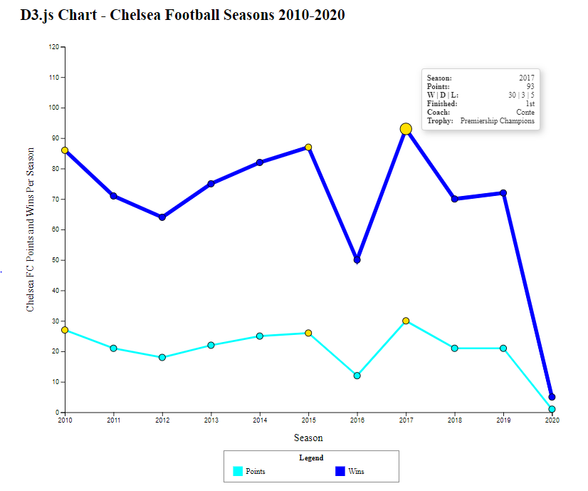
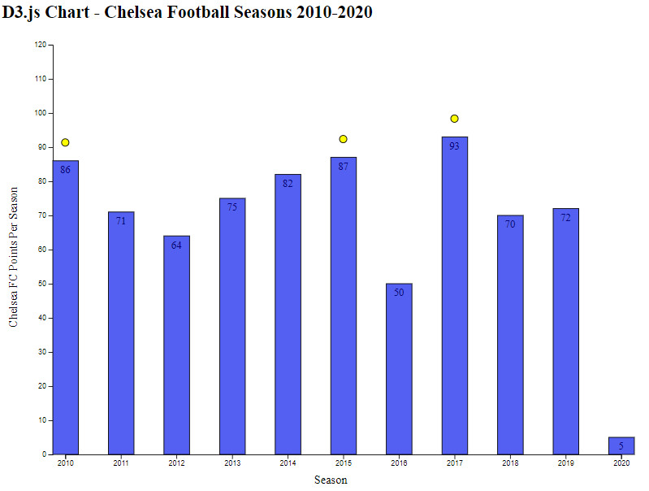

# MirLogic d3.js Assessment

**Welcome to the assessment for applicants to MirLogic's JavaScript developer position.**

As part of this position, successful applicants will use the JavaScript library d3 -- Data Driven Documents [D3.js](http://d3js.org) -- on a daily basis to create interactive data visualizations. This library is often combined with other JavaScript libraries and/or frameworks (such as jquery and React.js) to speed up user interactions with large datasets.

D3 can be used for a wide array of visualization types in which data is mapped to visual elements in the DOM. The library is completely customizable, so the world is your oyster when coding in D3. Further, there are a number of sites where D3 developers post their code, which can be used as a template to build on.

**The Assessment**  
**Due Date: At In-Person Interview** 
This assessment is a straight-forward test of your ability to create a chart in D3.js. We realize that many applicants may not have experience in D3. This should not prevent you from being able to complete the assessment, as there are many platforms available online that quickly teach you enough to be able to complete the task.

The data in this task is a .json file with the final season results of the English Premier League football team Chelsea FC for the past 10 years. The data includes the year, points accrued, wins, draws and losses, and other information about the team in each season (including the name of the coach and any trophies the team won).

It is your task to turn this information into a chart. It could be a simple bar or line chart, or anything more complicated that you wish to create.

The two PNG files provided in this repo are examples of charts you could design. Your solution does not have to look like either example, but we wanted to demonstrate some of the possibilities. Though you can't see them in the screenshots, these charts make use of hover, and mouseover/mouseout effects as well as tooltips.

**Example 1**

**Example 2**

*In this repo, we provide you with the following files/folders:*
* index.html
* Assessment_ss_1.PNG
* Assessment_ss_2.PNG
* static
  * css
    * style.css
  * js
    * app.js (empty)
    * d3.min.js
    * polyfill.js

When you download the repo, the files are already structured to run smoothly using a Python localhost Server (python -m http.server OR python -m SimpleHTTPServer). If you are more comfortable running on another local server (like node.js) feel free to do so.

* The **index.html** file is just the basics to show the visualization, you don't need to do anything here, but feel free
* In the **style.css** file, I left some code related to the tooltips (if you want to copy Assessment_ss_1), as well as code to create a hover effect. You may use or disregard
* The **d3.min.js** file and polyfill.js files have been left so that your d3 code runs without a hitch. You don't need to touch these files.
* The **app.js** file is where we expect most (if not all) of your coding to occur. We have left some comments regarding the steps to completing a visualization like those in the examples, but have not provided any code beyond the basic chart layout parameters.

We do expect this to be a somewhat challenging task if you have not previously coded in D3, but there are many platforms available online to learn basic D3.js quickly, and allow you to complete the assessment. If you are really struggling, do not worry about mirroring the examples, but do try to complete a basic bar or line chart with the given data.

_Good luck. We look forward to seeing what you create._
